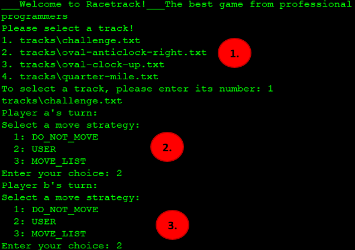
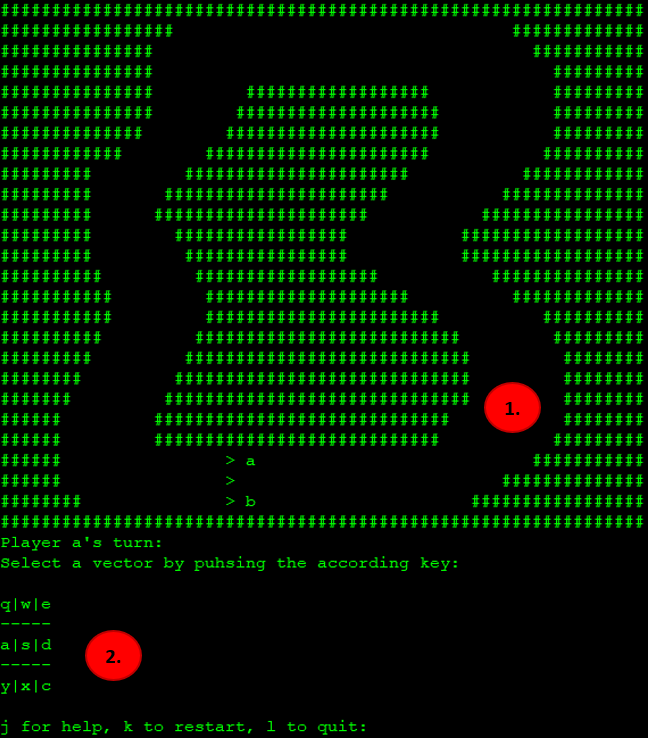
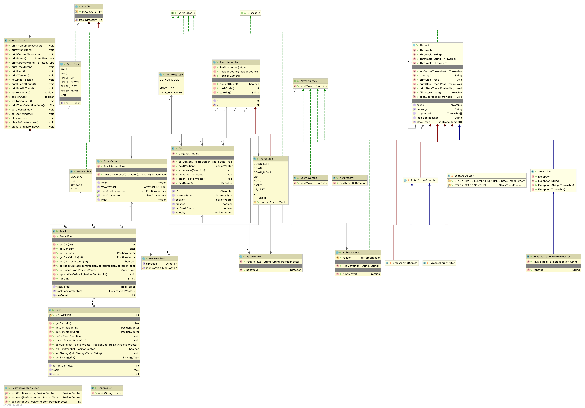

<h1 align="center">
    Racetrack
</h1>

## Contents

- [Requirements](#-requirements)
- [Documentation](#-documentation)
- [Built With](#built-with)
- [Authors](#authors)


## 📋 Requirements
* [Gradle](https://gradle.org/) - Build Management Tool
* [Java](https://www.oracle.com/de/java/) - Java SDK 11

## 📝 Documentation
* Our meeting minutes can be found [here](https://github.zhaw.ch/pm2-it19azh-ehri-fame-muon/gruppe7-Mers-projekt1-racetrack/tree/develop/Documents)
* The class diagram can be found [here](https://github.zhaw.ch/pm2-it19azh-ehri-fame-muon/gruppe7-Mers-projekt1-racetrack/blob/master/Documents/Klassendiagramm.png)
## 🧳 Built With

* [Java](https://www.oracle.com/de/java/) - Programming language 'our' choice
* [Gradle](https://gradle.org/) - Build Management Tool
* [draw.io](https://www.draw.io) - WebApp for creation of the classdiagram
* [IntelliJ IDEA](https://www.jetbrains.com/idea/) - IDE

## How to run

* Clone the [Code](https://github.zhaw.ch/pm2-it19azh-ehri-fame-muon/gruppe7-Mers-projekt1-racetrack) 
* Get in there with your IDE (you may start the program via the Controller class) or run it directly from your console with ```gradle run```

## The Game

* If you wan't to know more, visit the [racetrack wiki](https://de.wikipedia.org/wiki/Racetrack)

* After starting the game, you get greeted with following screen:



1. At first you can choose which track you wanna play (but watch out, the amount of cars on the track indicates the amount of players!)
2. The track we chose (challenge.txt) has two Cars on it - this means we get two choose the move strategy for Player 1...
3. ... and Player 2 (Increases logically with every Car more on the track)! 



1. After choosing your track and move strategy, the track gets printed...
2. ... and Player 1 can make his first move - the characters ```qwe asd yxc``` 
stand for the nine possible vectors in front of a Players Car one can choose to make a move (for a more detailed explanation see the ```j``` command in the game to see the ```help```).


* This goes on, Player after Player, until either just one Car is remaining on the track or a Car has reached the finish line. 
* There is also a ```k``` command to ```restart```... 
* ...and a ```l``` commmand to ```quit``` end the game.

## Klassendiagramm


## 👨‍👨‍👦‍👦 Authors

* **Tim Rhomberg** - [rhombtim](https://github.zhaw.ch/rhombtim)
* **David Mihajlovic** - [mihajdav](https://github.zhaw.ch/mihajdav)
* **Adrian Eyholzer** - [eyholadr](https://github.zhaw.ch/eyholadr)
* **Samuel Stalder** - [staldsam](https://github.zhaw.ch/staldsam)
